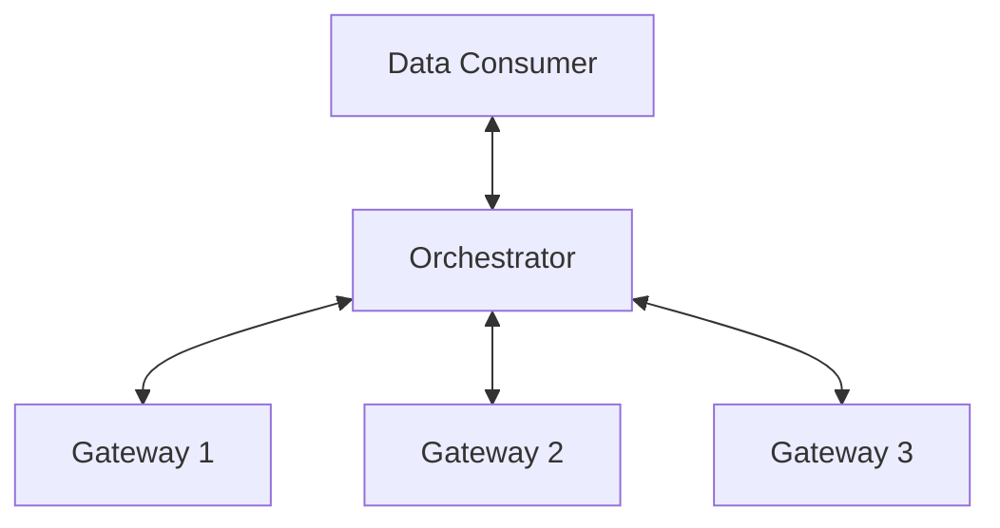

# Federated Machine Learning

## Technical Assessment

The product provides controlled access to sensitive data without giving users direct
access to that data.
The data resides in a closed environment called a "Compute Gateway", which can run an
instance of a machine learning model in a controlled way.
One or more gateways connect to a central server, known as the "Orchestrator".
The users send instructions to the Orchestrator through a command-line interface. The
orchestrator then distributes commands to the gateways, waits for them to perform their
computation, retrieves the results and aggregates them such that raw data should never
be returned to the end user.



A number of internally developed statistical and machine learning models are provided,
to which users can request access for running against sensitive data - the collection of
models is known as the "Model Registry".
Central to the product offering is the assurance that sensitive data cannot be accessed,
or inferred, by data consumers. Every model in the Model Registry comes with a set
of recommendations, which describes how to train the model and most importantly;
how to assess and improve the privacy-preserving capabilities of the model.
You are a machine learning engineer, developing a new "UNet" model for our
model registry, to enable our customers to perform image segmentation on unseen
images provided by a third-party.

### Written section

Write a short summary (max 500 words) of the potential privacy and security implications
for running a UNet segmentation model on sensitive data and how one might mitigate them.
Your should consider both ML and engineering concerns and cover at least the following
three cases:

- The model weights are pre-trained and fixed - the user performs inference against
  the source data and retrieves the resulting segmentations.
- The model structure is fixed, but the user can provide their own weights to run
  inference as above.
- The user is able to train a model against the sensitive data and download the
  resulting weights.

Some examples to consider:

- What are some common privacy attacks for computer vision models?
- How might a malicious user exploit the ability to upload a set of weights to gain
  access to the sensitive data?
- How do different model hyper-parameters affect convergence patterns and what
  might those convergence patterns reveal about the underlying data?

### Coding Test

Please see the provided Python file `federated_machine_learning.py`.
This script contains the boilerplate for a simple federated-learning training run using the
Federated Averaging algorithm, written in PyTorch.
Implemented in the script is a simple fully-connected model, which you will train to classify
input samples into one of two classes, based on whether the sum of all the inputs is above a
given threshold.
Also in the script are two classes `Orchestrator` and `Gateway`, which represent the
federation server and client. The orchestrator takes a list of `Gateway` objects and runs a
federated training job using them.
Each `Gateway` should train a local model based on a number of samples generated using the
`_generate_training_batch` function.
The `Orchestrator` should then gather all the trained weights from the gateways, aggregate
them and redistribute them to the gateways, before starting the next federation round.
In the script you'll notice some "to do" items, please implement these such that your model is able
to train over the randomly generated data.
Your solution should run in Python 3.12. If you add dependencies, please include an
updated requirements file to ensure we can reproduce your results.
The focus of this exercise is to help us understand how you problem solve and get a feel for
your coding style. As such we are not expecting candidates to spend time optimising the ML
model. However, your code should run and we would expect to see the accuracy plateau
around 80-90% with what is provided here.
You may wish to add some tests to ensure that your additions work as expected.

## Written assignment: Federated learning - potential privacy and security implications & mitigations

Here is a summary following from my brief research of and reflection on the topic:

1. The model weights are pre-trained and fixed - the user performs inference against
   the source data and retrieves the resulting segmentations.

- Risk:
  - One of the risks can be potential identification of entries present in the original training set
    (by testing specific input images & detecting for much stronger/crisper model response)
    or attempting to infer sensitive attributes present in the training set (perhaps with a mirror
    model - GAN or autoencoder based? - trained on the reverse of the inputs & outputs from the original model)
- Mitigations:
  - mitigation could be to apply quantization (or other lossy techniques - adding perturbation, noise)
    to the model output to restrict the possibility of reasoning about the model output
  - another mitigation could be to monitor for synthetic inputs or access patterns
    which could indicate attempts at probing the model

2. The model structure is fixed, but the user can provide their own weights to run
   inference as above.

- Risk:
  - The most obvious risk here is that the adversary could maliciously tune (amplify/dampen) the weights in such a way
    that the original input into the model from a restricted dataset would not be aggregated (or: passed through a complex function)
    but instead follow an isolated path through the network (or: passed through a much simpler, possibly reversible function) which could lead to leakage of sensitive information (either through direct read-out of the original values or reconstruction of original values as encoded by the "simplified" network)
- Mitigations:
  - the way to mitigate it could perhaps be to collect typical statistics about weights and scanning submitted weights for outliers / anomaly detection
  - another mitigation measure could be to screen outputs for correlation to inputs and flagging repeated, high correlation (either by scanning on synthetic data or withholding outputs for flagged cases)

3. The user is able to train a model against the sensitive data and download the
   resulting weights.

- Risk:
  - Here the biggest risk could be related to transfer learning (and, consequently, model/data theft)
    or reconstruction of the sensitive inputs (by constructing the model using reversible operations or architectures)
- Mitigations:
  - the mitigation could be to apply weight pruning or precision reduction to restrict fidelity of the weights
    and consequently of the outputs
  - restriction of the set of operations available to construct the model
  - some of the mitigations from point 2 could also be applicable here
  - speculative: application of formal methods (epistemic modal logic?) or model checkers

4. Other risks could be related to security vulnerabilities (buffer overflow, access elevation, etc.)
   in the inference pipelines (through carefully crafted requests, weights or models) which would lead
   to execution of arbitrary code and creating a side channel

- Mitigation:
  - here the mitigation would be similar to typical security threats (sanitization of inputs,
    enclave isolation of executed code, regular and prompt application of security patches,
    preventive pen-testing / read teaming)

5. There are some specifics of UNet architecture which may require particular attention,
   such as: shorter channels (skip connections) between the two arms of the model, tendency to over-segment
   (and thus reveal more information than may be necessary)

- Mitigation:
  - specific model also requires it own specific audit and mitigation measures - such as: selective
    masking on skip connections, lower segmentation fidelity applied during training, resolution downsampling, etc.

## Coding Test Implementation

The task does not prescribe two aspects required for model training:

1. The loss function - I opted for `CrossEntropyLoss` since its a frequent choice
   for classification tasks where the model outputs logits and the target is a class index
   (as is the case here). Other options could be `BCEWithLogitsLoss` (specifically designed
   for binary classification) or `MSELoss` (but only if we can treat the problem
   at hand as a regression to the target values of 0 and 1), other loss functions can be
   considered depending on the dataset or model characteristics.
2. The optimizer to handle gradient descent for learning the model weights (see more details below)

I tried three optimizers:

- `SGD` (staple stochastic gradient descent) - which reached accuracy of 84.38%
- `Adagrad` (only out of curiosity; I realize that it is more applicable to sparse data) - 96.88%
- `Adam` (closer to the current state of the art than `SGD`) - 100.00%
  Given that `Adam` is an adaptive optimizer it can converge quicker and this could explain reaching
  higher accuracy in the same number of rounds as `SGD`. However, it comes at a price of higher demands
  on the performance (thus if more cost effective compute instances are more desirable, `SGD` could be chosen
  and let run for more rounds). On the other hand if weight decay were observed then `AdamW` variant can be
  applied instead of `Adam`. In the context of federated learning I could imagine that faster convergence
  can be very beneficial, since it reduces number of communication rounds in a distributed system.

Note: To ensure training reproducibility I fixed the random seed to a constant value.

To run the (training) script in a controlled Docker environment:

```bash
docker build -t fml . && docker run --rm -it fml
```

I included only a couple of elementary tests:

1. One which runs the training multiple times and ensures training reaches each time the minimum bar of 80%
2. Another one specifically testing reproducibility of training

To run the tests:

```bash
docker build -t fml . && docker run --rm -it --entrypoint /bin/bash fml -c 'python -m unittest app.py'
```

To comment on the suggestion to test additions - I opted to use stock functions rather than approach
adding the weights iteratively to avoid making the mistake there (in general, these functions
are also optimized for performance).
However, if we would like the aggregation to be generalizable it would be good to double-check
if averaging weights itself is applicable to all/most model architectures, and if not, then offer an option
to override the default aggregation function.
